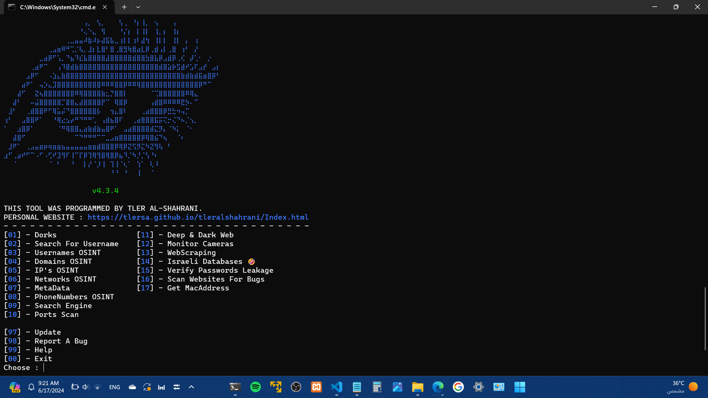

 # TS-OSINT (TLER AL-SHAHRANI-OSINT)
## أداة تطبيق مفهوم الـOSINT
###### OSINT = Open-Source Intelligence | استخبارات مفتوحة المصدر



### تثبيت المكاتب
```
pip install requests praw ipaddress psutil pillow opencv-python selenium rich phonenumbers bs4 telethon googlesearch-python tabulate
```

###  أوامر التثبيت (Linux, Termux, iSH)، بالنسبة للـWindows توجد نسخة .exe
```
sudo git clone https://github.com/tlersa/TS-OSINT.git
cd TS-OSINT/
sudo python3 TS-OSINT.py
```

### [نسخة .exe للـWindows](https://t.me/tler_sa/167)

### المميزات
- مجانية ومفتوحة المصدر ✔️
- سهولة الاستخدام وتعدد الخيارات لراحة المستخدم ✔️
- إذا لم تكن مثبت المكاتب المطلوبة سيتم تثبيتها تلقائيا ✔️
- المصداقية والدقة بالمعلومات المستخرجة بنسبة 💯✔️
- تعمل على كل الأنظمة ✔️
- بالخيار 1 يتم البحث عن الضحية في Google, Bing, Brave ✔️
- بالخيار 1 يمكنك تحديد عدد الصفحات المراد البحث فيها ✔️
- بالخيار 1 و10 و14 يتم حفظ نتائج البحث في ملف نصي وذلك لتحليل النتائج، وأيضا الثاني ولكن اختياري ✔️
- بالخيار 2 يتم البحث عن اسم المستخدم لحسابات الضحية في 62 منصة تواصل اجتماعي محلية وعالمية ✔️
- بالخيار 2 سرعة البحث عن اسم المستخدم لحسابات الضحية هو 0.5ث لكل منصة ✔️
- بالخيار 11 يمكنك تحديد عدد المنافذ المراد فحصها ✔️
- بالخيار 11 سرعة فحص المنافذ فحص 100 منفذ بنفس الوقت ✔️
- إمكانية تحديث الأداة بسهولة ✔️
### الخيارات
- الخيار 1 : مفهوم Google Dorks
- الخيار 2 : يبحث عن اسم المستخدم المراد البحث عنه في 61 منصة تواصل اجتماعي محلية وعالمية
- الخيار 3 : يستخرج معلومات المستخدمين الآتية لمنصات التواصل الآتية
  - منصة Instagram
    - معرّف المستخدم
    - هل هو حساب أعمال؟
    - هل الحساب موثق بالعلامة الزرقاء؟
    - هل الحساب خاص؟
    - اسم المستخدم
    - كنية المستخدم
    - صورة الحساب
    - عدد المتابعين
    - عدد الذين يتابعهم
    - عدد المشاهدين الذين يتابعهم
    - عدد المشاهدين
    - عدد المنشورات
    - هل هو ناشر قصص عامة؟
    - هل لديه قصص حاليا؟
    - هل لديه قصص مثبتة؟
    - عدد فيديوهات الـIGTV
    - وصف الحساب
    - روابط الوصف
    - هل لديه طلبات للمشاهدين؟
    - هل لديه طلبات من المشاهدين؟
  - منصة Telegram
    - اسم المستخدم
    - معرف المستخدم
    - الاسم الأول
    - الاسم الأخير
    - الرقم
  - منصة TikTok
    - اسم المستخدم
    - كنية المستخدم
    - معرّف المستخدم
    - معرّف المستخدم الثاني
    - هل الحساب موثق بالعلامة الزرقاء؟
    - هل الحساب خاص؟
    - موقع الحساب
    - عدد المتابعين
    - عدد الذين يتابعهم
    - هل المستخدم يسمح برؤية الآخرين للذين يتابعهم؟
    - عدد المنشورات
    - عدد الإعجابات الإجمالي
    - هل الحساب يسمح برؤية الآخرين للمنشورات المحفوظة؟
    - لغة الحساب
    - تاريخ إنشاء الحساب بالسنة والشهر
    - تاريخ آخر تغيير للكنية
  - منصة Github
    - اسم المستخدم
    - كنية المستخدم
    - نوع الحساب
    - رابط الحساب
    - معرّف الحساب
    - الشركة
    - الوصف
    - البريد الإلكرتوني العام
    - روابط الوصف
    - رابط حساب X المرتبط
    - صورة الحساب
    - موقع الحساب
    - عدد المتابعين
    - عدد الذين يتابعهم
    - المستودعات العامة
    - الـgits العامة
    - تاريخ إنشاء الحساب
    - الـHireable
    - آخر تحديث للحساب
  - منصة Reddit
    - اسم المستخدم
    - كنية المستخدم
    - معرّف المستخدم
    - صورة الحساب
    - الوصف
    - روابط الوصف
    - البريد الإلكتروني العام
    - الرقم العام
    - تاريخ إنشاء الحساب
  - منصة Tellonym
    - اسم المستخدم
    - كنية المستخدم
    - معرّف المستخدم
    - الوصف
    - صورة الحساب
    - موقع الحساب
    - عدد المتابعين
    - عدد المتابعين الحقيقين
    - عدد المتابعين الغير معروفين
    - عدد الذين يتابعهم
    - عدد التيل
    - عدد الأسئلة
    - عدد الإعجابات الإجمالية
    - هل الحساب موثق؟
    - هل الحساب يستطيع التعليق؟
    - هل الحساب متصل الآن؟
  - منصة Sony
    - الخيار 1 و2 و3 : جلب معلومات الآتية لحسابك ماعدا من الجوائز إلى المحظورين بالخيار 2 و3
      - المعرّف
      - اسم المستخدم
      - كنية المستخدم
      - جهاز PlayStation
      - معرّف الجهاز
      - نوع الجهاز
      - تاريخ أول اتصال بالجهاز
      - صورة الحساب
      - هل يملك اشتراك بلس؟
      - الجوائز
      - قائمة الأصدقاء
      - قائمة المحظورين
- الخيار 4 : استخراج المعلومات الآتية لأي موقع بواسطة الـIP او الـDomain الخاص به
  - الـURL
  - الـIP
  - الـIP بصيغة Binary
  - الـIP بصيغة Hex
  - إصدار الـIP
  - مزود حدمة الإنرنت
  - الـFQDN
  - الـAsn
  - حالة الموقع
  - القارة
  - رمز القارة
  - الدولة
  - رمز الدولة
  - موقع الموقع
  - اسم منطقة الموقع
  - المدينة
  - المنطقة/المقاطعة/الحي/الدائرة/المحافظة/القضاء/الجزئية/الإقليم/المديرية/القسم
  - الرمز البريدي
  - العملة
  - خطوط الطول
  - خطوط العرض
  - الـOffset
  - الهاتف
  - الـProxy
  - مكان الاستضافة
- الخيار 5 : ينقسم لقسمين :
  - القسم الأول : استخراج معلومات الـIP الآتية للضحية بواسطة الـIP الخاص به
    - الـIP
    - إصدار الـIP
    - الـIP بصيغة Binary
    - الـIP بصيغة Hex
    - مزود خدمة الانرنت
    - الدولة
    - المنطقة
    - المدينة
    - الرمز البريدي
    - خطوط الطول
    - خطوط العرض
  - القسم الثاني : استخراج المعلومات الآتية لجهاز مستخدم الأداة
    - نظام التشغيل
    - نسخة نظام التشغيل
    - البت وبيئة التثبيت
    - عدد النواة الإجمالي والمادي
    - الحد الأقصى والأدنى والتردد الحالي
    - نموذج عن استخدام المعالج
    - مساحة التخزين الإجمالية والمستخدمة والفارغة
    - اسم استضافة الجهاز بالشبكة
    - الـIP
    - إصدار الـIP
    - الـIP بصيغة Binary
    - الـIP بصيغة Hex
    - الـIPV6
- الخيار 6 : ينقسم لـ3 أقسام :
  - القسم الأول : استخراج معلومات تفصيلية عن الشبكات المتصلة بالجهاز حاليا
  - القسم الثاني : استخراج العمليات الشبكية الجارية
  - القسم الثالث : جلب موقع الشبكة وإمكانية إظهار موقعها بخرائط Google
- الخيار 7 : استخراج المعلومات الآتية للصور
  - اسم الجهاز الذي صور الصورة
  - تشفير الصورة
  - الـExifOffset
  - الـSubsecTimeOriginal
  - تاريخ التقاط الصورة بالسنة والشهر واليوم والساعة والدقيقة والثانية وأجزاء الثانية
  - فئة الصورة
  - المدينة الطبيعية
  - نوع الصورة
  - القارة
  - الدولة
  - رمز الدولة
  - المقاطع
  - رمز المقاطعة
  - الاتحاد السياسي
  - السكك الحديدية
  - الطريق
  - الولاية
  - القرية
  - الطريق السريع
  - رابط موقع تصوير الصورة بخرائط Google
- الخيار 8 : ينقسم لقسمين :
  - القسم الأول : استخراج المعلومات الآتية لأرقام الهاتف العالمية
    - موقع الرقم
    - المنطقة الزمنية
    - شركة الاتصالات
  - القسم الثاني : البحث عن المعلومات الآتية عبر إدخال اسم الشخص، هذا الخيار متوفر لكل دول العالم
    - رقم الهاتف
    - اسم الشخص
    - رمز الدولة
    - عنوان الشخص
- الخيار 9 : استخراج منصات التواصل الاجتماعي المسجل بها البريد الإلكتروني للضحية، حاليا توجد 3 منصات
- الخيار 10 : محرك بحث Google، تستطيع البحث عن أي شيء تريده وتحديد عدد نتائج البحث
- الخيار 11 : فحص منافذ جهاز الضحية واستخراج المفتوحة منها
- الخيار 12 : أشهر محركات بحث Deep & Dark Web
- الخيار 13 : ينقسم لقسمين
  - القسم الأول : مراقبة كاميرات 94 دولة حول العالم
  - القسم الثاني : مراقبة كاميرات متواجدة بـ53 مكان حول العالم
- الخيار 14 : تطبيق مفهوم الـWebScraping (استخراج محتويات الموقع مثل المسارات والملفات والصور إلخ...)
- الخيار 15 : جلب ملفات الكوكيز للمستخدمين بمواقع بروتوكول Http
- الخيار 16 : قواعد بيانات إسرائيلية مسربة
- الخيار 17 : التحقق من إذا كانت كلمة سرك مسربة أو لا
- الخيار 18 : فحص المواقع الإلكترونية عن الثغرات، ويتم الفحص عن 16 ثغرة
- الخيار 19 : جلب عنوان الـMac لجهاز المستخدم
- الخيار 20 : التحقق من تسرب البطاقة البنكية للمستخدم
- الخيار 21 : فحص الروابط من البرمجيات الخبيثة
- الخيار 22 : إنشاء المعلومات الشخصية ااوهمية الآتية مع إمكانية تحديد اللغة والدولة وتتوفر حاليا أغلب اللغات ودول العالم
  - الاسم
  - العمر
  - تاريخ المبلاد
  - عنوان السكن
  - رقم الهاتف
  - البريد الإلكتروني
  - نوع الهاتف
  - الحالة الاجتماعية
  - الوظيفة إذا كان موظف
  - الشركة إذا كان موظف
  - الـIPv4 العام
  - الـIPv4 الخاص
  - الـIPv6
  - عنوان الـMac
  - عنوان بطاقة الشبكة (NIC)
  - الـBBAN
  - الـIBAM
  - جهة البطاقة البنكية
  - رقم البطاقة البنكية
  - رمز الآمان للبطاقة البنكية
  - تاربخ انتهاء البطاقة البنكية
  - رقم الـSwift للبنك
  - الرصيد المالي
  - رقم جواز السفر
  - تاريخ جواز السفر
  - اسم السيارة ولونها
  - رقم لوحة السيارة
  - رقم هيكل السيارة
  - اللون المفضل
  - الطعام المفضل
- الخيار 23 : ادخال كلمة مفتاحية لإنشاء هاشتاقات منها، تفيد صنَّاع المحتوى
- الخيار 24 : استخراج لوحات تسجيل الدخول من المواقع الإلكترونية
- الخيار 25 : استخراج معلومات السيارة ومالكها باسم اللوحة، وهذا الخيار متوفر للدول الآتية : 🇮🇱
- الخيار 97 : تحديث الأداة
- الخيار 98 : الإبلاغ عن ثغرة بالأداة
- الخيار 99 : طلب مساعدة
- الخيار 00 : الخروج من الأداة
 
### ملاحظات ⚠️
- الخيار 3 منصة Telegram ستحتاج لمعرّف الـAPI والـAPI hash وهذه تحصل عليها من [هنا](https://my.telegram.org/apps)
- الخيار 3 منصة Telegram سيتم إنشاء ملف اسمه session_name.session لا عليك منه
- الخيار 3 منصة Reddit ستحتاج للـClient ID والـClient secert والـUser agent وهذه تحصل عليها من [هنا](https://www.reddit.com/prefs/apps/)
- الخيار 3 منصة Tellonym لا يعمل على الهواتف
- الخيار 3 منصة Sony ستحتاج لـNpsso وهذا تحصل عليه بعد تسجيل الدخول بالموقع الرسمي للمنصة ثم الدخول [هنا](https://ca.account.sony.com/api/v1/ssocookie)
- الخيار 6 القسم الثالث يجب أن تسجل دخول بهذا [الموقع](https://www.mylnikov.org/)
- الخيار 7 يجب أن تحدد الصور المصورة من الكاميرا مباشرة فقط
- الخيار 7 قد تكون المعلومات من (تاريخ التقاط الصورة...~رابط موقع تصوير...) غير دقيقة/صحيحة وهذا بسبب محتوى الصورة أولا وثانيا من المكتبة PIL المستخدمة
- الخيار 10 سيتم إنشاء ملف اسمه .google-cookie لا عليك منه
- الخيار 14 اسم المجلد هو Downloaded images
